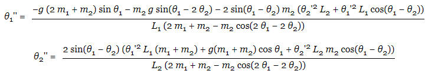

# Double-Pendulum-using-p5.js

#### This is a simple p5.js project that simulates the motion of a double pendulum

The double pendulum as the name suggests is a combination of two single pendula. 
It consists of two masses that are interconnected by rods, of which one end is attached to a support, while
the other end is suspended freely.

Once raised to a height and released freely, it generates a random chaotic motion that is mesmerising to watch.

The code that implements this concept is rather simple.
It only consists of two equations that track the motion of the two masses.
This is as follows:

Once the tweaking of the variables of motion is done, the pendulum exhibits the following motion:

